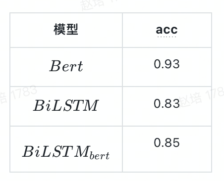

# knowledge_-distillation

## Distilling Task-Specific Knowledge from BERT into Simple Neural Networks 
代码参考
使用BiLSTM蒸馏下游bert分类模型
### 训练步骤
先设置环境变量
```angular2html
export PYTHONPATH={PROJECT_PATH}
```
1. 使用预训练bert在特定数据集合fine-tuning
```angular2html
cd src/distill_task_specific_bert
python bert_classification.py
```
2. 用BiLSTM蒸馏fine-tuned bert
```angular2html
python distill.py
```
### 实验效果



